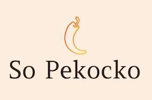

# Build-API: Application API

## To begin

- go through backend folder ( Cd frontend) in terminal
- Execute nodemon

- and then open the backend folder (cd backend )
- Execute npm start

## Front-end server

- This is the MVP of the So Pekocko web application, a hot sauce company.

## Prerequis

- You need to install Node and npm locally on your computer.

## I used

- NodeJS JavaScript runtime environment
- Express Framework Node.js
- MongoDB database

## Security Requirements

- User password encrypted
- Transport and storage of PII secure.
- Authentication reinforced on the required routes
- Email addresses in the database are unique and an appropriate Mongoose plugin is used to ensure their uniqueness and report errors

## API Routes

- All sauce-related routes require an authenticated request (containing a valid token in its Authorization header: "Bearer <token>")
